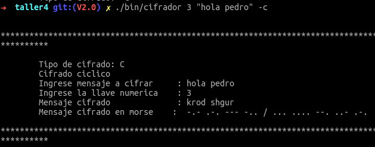
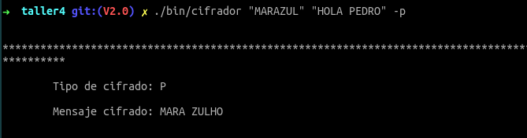

# Taller 4 - Programacion de sistemas

## Integrantes
* Bosco Armando Andrade Bravo

* Israel Cano Guerrero

* Joel Eduardo Rodriguez Llamuca

## Instrucciones

### Compilado
Ejecutar make en la carpeta root de proyecto
```sh
$ make
```

Esto generara el ejecutable.

### Ejecutado Programa
Para ejecutarlo solo hacer:

```sh
$ ./bin/cifrador
```

### Opciones de ejecutado

#### Cifrado ciclico

_argumentos permitidos_

| numero cifrado | palabra a cifrar        | opcion de cifrar |
|:---------------|:------------------------|:-----------------|
| [1-9]*          | String entre parentesis | -c               |

```sh
./bin/cifrador 3 "hola pedro" -c
```

_salida_



#### Cifrado contrasena

_argumentos permitidos_

| palaba contrasena | palabra a cifrar        | opcion de cifrar |
|:---------------|:------------------------|:-----------------|
| String         | String entre parentesis | -p               |

```sh
$ ./bin/cifrador "MARAZUL" "HOLA PEDRO" -p
```

_salida_



# Otros

Los archivos gulpfile.js, package.json y yarn.lock son para autoejecutado de make cuando cambia un archivo
